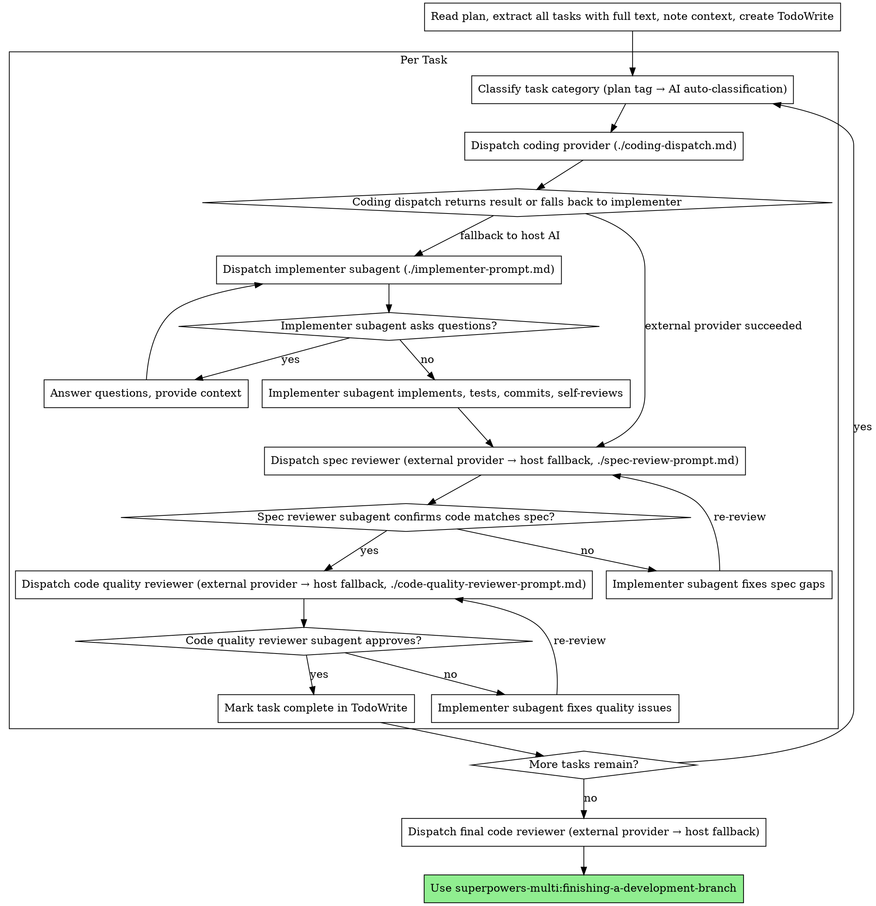

# Multi-AI Coding Dispatch Implementation Plan

> **For agentic workers:** REQUIRED SUB-SKILL: Use superpowers-multi:subagent-driven-development (recommended) or superpowers-multi:executing-plans to implement this plan task-by-task. Steps use checkbox (`- [ ]`) syntax for tracking.

**Goal:** Extend the multi-AI provider system to route coding (implementation) tasks to configurable external AI providers, with category-based routing for frontend/backend work and fallback to the host AI.

**Architecture:** A new `coding-dispatch.md` in `skills/subagent-driven-development/` mirrors the review dispatch pattern (7-step flow: check enabled → resolve provider → load definition → plugin override → CLI dispatch → validate → fallback). Provider JSON files are shared with the review system, extended with optional `invoke_coding` / `plugin_override_coding` fields. The SDD task loop is modified to insert category classification and coding dispatch before the existing implementer step.

**Tech Stack:** Markdown (skill files), JSON (provider definitions)

**Spec:** Design spec was inlined into this plan (original spec file removed)

---

## File Structure

| File | Action | Responsibility |
|------|--------|----------------|
| `skills/subagent-driven-development/coding-dispatch.md` | Create | 7-step routing logic for coding tasks |
| `skills/subagent-driven-development/coding-prompt.md` | Create | Provider-agnostic implementation prompt template |
| `skills/subagent-driven-development/SKILL.md` | Modify | Integrate category classification + coding dispatch into task loop |
| `skills/writing-plans/SKILL.md` | Modify | Add category tag guidance to Task Structure section |
| `skills/requesting-code-review/providers/codex.json` | Modify | Add optional `invoke_coding` and `plugin_override_coding` |
| `skills/requesting-code-review/providers/claude-code.json` | Modify | Add optional `invoke_coding` |

---

### Task 1: Create coding-prompt.md
category: backend

**Files:**
- Create: `skills/subagent-driven-development/coding-prompt.md`

- [ ] **Step 1: Create the coding prompt template**

Create `skills/subagent-driven-development/coding-prompt.md`:

```markdown
# Coding Prompt Template

Provider-agnostic template for implementation tasks dispatched to external AI CLIs.
Fill placeholders before sending to provider.

---

# Implementation Task: {TASK_NAME}

## Task

{TASK_DESCRIPTION}

## Context

{CONTEXT}

## Working Directory

{WORKING_DIR}

## Requirements

- Implement the task as described
- Follow existing code patterns and conventions
- Write tests for new functionality
- Commit changes with a descriptive message

## Constraints

- Only modify files relevant to this task
- Do not refactor unrelated code
- If blocked or need clarification, report what you need instead of guessing

## Reference: Full Plan

{PLAN_CONTENT}
```

- [ ] **Step 2: Verify the file exists and is valid markdown**

Run:
```bash
test -f skills/subagent-driven-development/coding-prompt.md && echo "exists" || echo "missing"
```
Expected: `exists`

- [ ] **Step 3: Commit**

```bash
git add skills/subagent-driven-development/coding-prompt.md
git commit -m "feat: add provider-agnostic coding prompt template"
```

---

### Task 2: Create coding-dispatch.md
category: backend

> **Note:** The code block below is the original plan version. The deployed file at `skills/subagent-driven-development/coding-dispatch.md` includes post-review fixes (C1: `command` fallback, C2: uncommitted change detection, config JSON example). The deployed file is authoritative.

**Files:**
- Create: `skills/subagent-driven-development/coding-dispatch.md`
- Reference: `skills/requesting-code-review/review-dispatch.md` (pattern to mirror)

- [ ] **Step 1: Create the coding dispatch file**

Create `skills/subagent-driven-development/coding-dispatch.md`:

```markdown
# Coding Dispatch Guide

Centralized dispatch logic for routing implementation tasks to external AI providers.
Mirrors the review dispatch pattern (`skills/requesting-code-review/review-dispatch.md`).

## Parameters

The caller provides:
- **task_name**: Name of the task being implemented
- **task_description**: Full text of the task from the plan
- **task_category**: Classified category (frontend / backend / fullstack / etc.)
- **context**: Scene-setting, dependencies, working directory
- **plan_content**: Full plan text for reference

## Step 1: Check Coding Enabled

Read `.superpowers/review-config.json`.

**Config file does not exist OR `coding` key is absent** → prompt the user:

> "Multi-AI coding dispatch is available but not configured. To route implementation tasks to external AI providers (e.g., different providers for frontend vs backend), add a `coding` section to `.superpowers/review-config.json`. Would you like to set it up now?"

- If user **declines** → skip to Step 7 (Fallback). Remember this choice for the session — do not prompt again.
- If user **agrees** → guide them through setup:
  1. Ask which default provider to use (scan `skills/requesting-code-review/providers/` for available CLIs)
  2. Ask if they want category-specific rules (e.g., frontend → claude-code, backend → codex)
  3. Write the `coding` section to `.superpowers/review-config.json` (create file if needed)
  4. Proceed to Step 2

**`coding.enabled` is explicitly `false`** → skip to Step 7 silently. The user has opted out.

**`coding.enabled` is `true`** → proceed to Step 2.

## Step 2: Resolve Provider

Check in this order (first match wins):

1. **Category rule match** → scan `coding.rules` for an entry where `category` equals `task_category`. Use that rule's `provider` value.
2. **Default provider** → use `coding.default_provider` if set.
3. **No config, no match** → discover and ask:
   a. Scan `skills/requesting-code-review/providers/` for all `*.json` files
   b. For each provider, run its `detect` command to check if the CLI is installed
   c. Present the user with available providers: name + description
   d. User selects one. Remember this choice for the rest of the session (do not write to disk)

## Step 3: Load Provider Definition

Read `skills/requesting-code-review/providers/<provider-name>.json`.

If the file does not exist: notify the user "Unknown coding provider '<name>'. Available providers: [list names from providers/ directory]." Ask the user to choose from available providers. Remember the choice for the session.

## Step 4: Check Plugin Override

Resolve the override: use `plugin_override_coding` if present; otherwise fall back to `plugin_override`.

If the resolved override is non-null AND the current host AI matches its `host` field:

1. Save current HEAD SHA as `pre_dispatch_sha`: `git rev-parse HEAD`
2. Fill `./coding-prompt.md` template placeholders with caller-provided values
3. Dispatch as a subagent via the override's `subagent` type with the filled prompt
4. Validate the response (see Step 6)
5. If validation passes → return the result (done)
6. If validation fails → continue to Step 5 (CLI Dispatch)

If the resolved override is null or host does not match → continue to Step 5.

## Step 5: CLI Dispatch

Resolve invocation config: for each field (`args`, `input_method`, `timeout_seconds`), use `invoke_coding.<field>` if present; otherwise fall back to `invoke.<field>`.

1. Save current HEAD SHA as `pre_dispatch_sha` (if not already saved in Step 4): `git rev-parse HEAD`

2. Run the provider's `detect` command via Bash
   - If it fails (non-zero exit) → go to Step 7 (Fallback)

3. Fill `./coding-prompt.md` template placeholders with caller-provided values

4. Write the filled prompt to a temporary file (e.g. `/tmp/coding-prompt-<timestamp>.md`)

5. Build and execute the CLI command:
   - If `input_method` is `"file"`: replace `{{prompt_file}}` in resolved `args` with the temp file path, then run `timeout <timeout_seconds> <command> <args...>`
   - If `input_method` is `"stdin"`: run `timeout <timeout_seconds> <command> <args...> < <temp_file>`

6. Capture stdout as the coding response

7. Clean up the temporary file

8. Validate the response (see Step 6)
   - If valid → return the result (done)
   - If invalid or execution error (including timeout) → check for Q&A (see Q&A Handling), then go to Step 7 (Fallback)

## Step 6: Result Validation

Validation uses the `pre_dispatch_sha` saved before dispatch.

- **File change check**: Run `git diff --stat <pre_dispatch_sha>..HEAD` — at least one file must have changed (covers both committed and uncommitted changes)
- **Empty response check**: CLI output must not be empty
- **Timeout check**: CLI must have exited normally (exit code 0, not killed by timeout)

If any check fails → proceed to Q&A Handling or Step 7 (Fallback).
If all pass → return the result to the caller.

## Q&A Handling

When result validation fails due to **no file changes** (but the CLI produced non-empty output), check if the external AI is asking questions:

**Detection:** If `git diff --stat <pre_dispatch_sha>..HEAD` is empty AND the output contains question-like patterns (interrogative sentences, "I need to know", "please clarify", "could you provide", etc.), treat it as a Q&A response.

**Plugin override (subagent) dispatch:**
- Same as the existing NEEDS_CONTEXT flow — the subagent returns a question, the host AI answers, and the subagent is re-dispatched with the answer appended to context.
- Maximum 3 Q&A rounds before falling back to Step 7.

**CLI dispatch:**
- The host AI appends its answer to the `{CONTEXT}` section of the coding prompt and re-executes the CLI with the augmented prompt.
- Maximum 2 CLI re-executions (3 total attempts including the original).
- If still no file changes after the limit → fall back to Step 7 with all accumulated Q&A context.

**Rationale:** CLI round-trips are expensive (full process restart). The limit is lower than subagent Q&A because subagents maintain conversational state.

## Step 7: Fallback

If reached from Step 1 (coding not configured and user declined, or explicitly disabled):
- This is the existing SDD behavior, not a degraded path.
- Use host AI `general-purpose` subagent with `./implementer-prompt.md` template.

If reached from Steps 5/6/Q&A (external provider failed):
1. Notify the user: "External coding via <provider-name> failed: <reason>. Falling back to host implementer."
2. Use host AI `general-purpose` subagent with `./implementer-prompt.md` template, passing all accumulated Q&A context (if any) in the Context section.
```

- [ ] **Step 2: Verify the file exists**

Run:
```bash
test -f skills/subagent-driven-development/coding-dispatch.md && echo "exists" || echo "missing"
```
Expected: `exists`

- [ ] **Step 3: Verify internal references are correct**

Check that all referenced files exist:
```bash
test -f skills/subagent-driven-development/coding-prompt.md && echo "coding-prompt.md: ok" || echo "coding-prompt.md: MISSING"
test -f skills/subagent-driven-development/implementer-prompt.md && echo "implementer-prompt.md: ok" || echo "implementer-prompt.md: MISSING"
test -f skills/requesting-code-review/review-dispatch.md && echo "review-dispatch.md: ok" || echo "review-dispatch.md: MISSING"
test -d skills/requesting-code-review/providers && echo "providers/: ok" || echo "providers/: MISSING"
```
Expected: All print "ok"

- [ ] **Step 4: Commit**

```bash
git add skills/subagent-driven-development/coding-dispatch.md
git commit -m "feat: add coding dispatch logic for multi-AI provider routing"
```

---

### Task 3: Extend provider JSON files with optional coding fields
category: backend

**Files:**
- Modify: `skills/requesting-code-review/providers/codex.json`
- Modify: `skills/requesting-code-review/providers/claude-code.json`

- [ ] **Step 1: Update codex.json**

Edit `skills/requesting-code-review/providers/codex.json` to add `invoke_coding` and `plugin_override_coding`:

```json
{
  "name": "codex",
  "description": "OpenAI Codex CLI",
  "detect": "which codex",
  "invoke": {
    "command": "codex",
    "args": ["--quiet", "--prompt-file", "{{prompt_file}}"],
    "input_method": "file",
    "timeout_seconds": 300
  },
  "invoke_coding": {
    "args": ["--prompt-file", "{{prompt_file}}"],
    "input_method": "file",
    "timeout_seconds": 600
  },
  "plugin_override": {
    "host": "claude-code",
    "subagent": "codex:codex-rescue"
  },
  "plugin_override_coding": {
    "host": "claude-code",
    "subagent": "codex:codex-rescue"
  }
}
```

Changes from existing:
- Added `invoke_coding`: removes `--quiet` flag (coding output may need visibility), doubles timeout to 600s
- Added `plugin_override_coding`: same subagent for now (can be changed later when a dedicated coding subagent exists)

- [ ] **Step 2: Update claude-code.json**

Edit `skills/requesting-code-review/providers/claude-code.json` to add `invoke_coding`:

```json
{
  "name": "claude-code",
  "description": "Anthropic Claude Code CLI",
  "detect": "which claude",
  "invoke": {
    "command": "claude",
    "args": ["-p", "--output-format", "text"],
    "input_method": "stdin",
    "timeout_seconds": 300
  },
  "invoke_coding": {
    "args": ["-p", "--output-format", "text"],
    "input_method": "stdin",
    "timeout_seconds": 600
  },
  "plugin_override": null,
  "plugin_override_coding": null
}
```

Changes from existing:
- Added `invoke_coding`: same args (Claude Code `-p` mode does write files), timeout doubled to 600s
- Added `plugin_override_coding`: null (same as review)

- [ ] **Step 3: Verify JSON validity**

Run:
```bash
python3 -c "import json; json.load(open('skills/requesting-code-review/providers/codex.json')); print('codex.json: valid')"
python3 -c "import json; json.load(open('skills/requesting-code-review/providers/claude-code.json')); print('claude-code.json: valid')"
```
Expected: Both print "valid"

- [ ] **Step 4: Verify review dispatch still works (no breaking changes)**

Confirm the existing `invoke` and `plugin_override` fields are unchanged:
```bash
python3 -c "
import json
with open('skills/requesting-code-review/providers/codex.json') as f:
    d = json.load(f)
    assert d['invoke']['args'] == ['--quiet', '--prompt-file', '{{prompt_file}}'], 'codex invoke.args changed!'
    assert d['plugin_override']['subagent'] == 'codex:codex-rescue', 'codex plugin_override changed!'
    print('codex.json: review fields intact')
with open('skills/requesting-code-review/providers/claude-code.json') as f:
    d = json.load(f)
    assert d['invoke']['args'] == ['-p', '--output-format', 'text'], 'claude-code invoke.args changed!'
    assert d['plugin_override'] is None, 'claude-code plugin_override changed!'
    print('claude-code.json: review fields intact')
"
```
Expected: Both print "review fields intact"

- [ ] **Step 5: Commit**

```bash
git add skills/requesting-code-review/providers/codex.json skills/requesting-code-review/providers/claude-code.json
git commit -m "feat: extend provider definitions with optional coding fields"
```

---

### Task 4: Modify SDD SKILL.md to integrate coding dispatch
category: backend

**Files:**
- Modify: `skills/subagent-driven-development/SKILL.md:1-297`

This is the most complex task. The SDD SKILL.md needs three changes:
1. Update the process flowchart to include category classification + coding dispatch
2. Add a new "Coding Dispatch" section describing the integration
3. Update the Prompt Templates section to reference new files

- [ ] **Step 1: Update the process flowchart (lines 42-84)**

Replace the process flowchart `digraph process` block. The changes are:
- Add "Classify task category" node before implementer dispatch
- Add "Dispatch coding provider (./coding-dispatch.md)" node
- Route through coding dispatch → result validation → existing review flow
- Keep the fallback path to implementer-prompt.md

Replace the entire `digraph process` block (lines 42-84) with:



- [ ] **Step 2: Add Coding Dispatch section after line 8 (after the opening description)**

Insert after the existing opening paragraph (line 8, ending with `...host AI fallback (see skills/requesting-code-review/review-dispatch.md).`):

```markdown

**Coding dispatch:** Before dispatching the host AI implementer, the system can route implementation tasks to an external AI coding provider based on task category (frontend, backend, etc.). This is configured in `.superpowers/review-config.json` under the `coding` key. When disabled or unconfigured, the existing host AI implementer flow is used. See `./coding-dispatch.md` for the full routing logic.
```

- [ ] **Step 3: Add Task Category Classification section after "Model Selection" (after line 100)**

Insert after the Model Selection section (after line 100, `- Requires design judgment or broad codebase understanding → most capable model`):

```markdown

## Task Category Classification

Before dispatching each task, classify it into a category for provider routing:

**Priority 1 — Plan tag:** If the task has a `category:` field (e.g., `category: frontend`), use that value directly.

**Priority 2 — AI auto-classification:** If no tag is present, classify based on task content:

| Category | Signals |
|----------|---------|
| `frontend` | UI components, styling, layout, browser APIs, frontend routing, state management |
| `backend` | API endpoints, DB operations, auth, business logic, server-side processing, migrations |
| `fullstack` | Task spans both frontend and backend layers |

Pass the classified category to `./coding-dispatch.md` as the `task_category` parameter.
```

- [ ] **Step 4: Update Prompt Templates section (line 120-125)**

Replace the Prompt Templates section with:

```markdown
## Prompt Templates

- `./coding-dispatch.md` - Coding task routing logic (category → provider → CLI/subagent → validation → fallback)
- `./coding-prompt.md` - Provider-agnostic coding prompt template (used by coding-dispatch.md)
- `./implementer-prompt.md` - Dispatch implementer subagent (used as fallback when coding dispatch is disabled or fails)
- `./spec-review-prompt.md` - Spec compliance review template (provider-agnostic)
- `./code-quality-reviewer-prompt.md` - Code quality review dispatch reference (delegates to `review-dispatch.md`)
- `skills/requesting-code-review/review-dispatch.md` - Centralized dispatch logic for all review types
```

- [ ] **Step 5: Update the Integration section (line 283-296)**

Add coding dispatch reference to the Integration section. After `- **review-dispatch.md** - Configurable external review provider with host AI fallback` (line 289), insert:

```markdown
- **./coding-dispatch.md** - Configurable external coding provider with host AI fallback
```

- [ ] **Step 6: Verify the file is well-formed**

Run:
```bash
head -10 skills/subagent-driven-development/SKILL.md
echo "---"
grep -c "coding-dispatch" skills/subagent-driven-development/SKILL.md
```
Expected: Header shows correctly, and `coding-dispatch` appears at least 3 times (flowchart, prompt templates, integration)

- [ ] **Step 7: Commit**

```bash
git add skills/subagent-driven-development/SKILL.md
git commit -m "feat: integrate coding dispatch into SDD task execution loop"
```

---

### Task 5: Add category tag guidance to writing-plans SKILL.md
category: backend

**Files:**
- Modify: `skills/writing-plans/SKILL.md:63-104`

- [ ] **Step 1: Add category field to the Task Structure template**

In the Task Structure section (line 63-104), add an optional `category:` field after the task heading. Replace:

````markdown
### Task N: [Component Name]

**Files:**
- Create: `exact/path/to/file.py`
- Modify: `exact/path/to/existing.py:123-145`
- Test: `tests/exact/path/to/test.py`
````

With:

````markdown
### Task N: [Component Name]
category: frontend | backend | fullstack

**Files:**
- Create: `exact/path/to/file.py`
- Modify: `exact/path/to/existing.py:123-145`
- Test: `tests/exact/path/to/test.py`
````

- [ ] **Step 2: Add category tag guidance section**

After the Task Structure section's closing ```` (line 104), before the "No Placeholders" section (line 106), insert:

```markdown

## Category Tags (Optional)

When the project uses multi-AI coding dispatch (`.superpowers/review-config.json` with `coding.enabled: true`), tasks can include a `category:` field to control which AI provider handles the implementation:

- `frontend` — UI components, styling, browser APIs, state management
- `backend` — API endpoints, DB operations, business logic, migrations
- `fullstack` — spans both layers

The `category:` line goes directly after the task heading (`### Task N:`), before `**Files:**`.

**This is optional.** If omitted, the coding dispatch system auto-classifies based on task content. Include it when auto-classification might get it wrong (e.g., a test file for UI components that lives in a backend test directory).
```

- [ ] **Step 3: Verify the changes**

Run:
```bash
grep -n "category:" skills/writing-plans/SKILL.md
```
Expected: At least 2 matches (in Task Structure template and in Category Tags section)

- [ ] **Step 4: Commit**

```bash
git add skills/writing-plans/SKILL.md
git commit -m "feat: add category tag guidance to writing-plans skill"
```

---

### Task 6: End-to-end verification
category: backend

**Files:**
- Reference only (no modifications)

- [ ] **Step 1: Verify all new files exist**

Run:
```bash
echo "=== New files ==="
test -f skills/subagent-driven-development/coding-dispatch.md && echo "coding-dispatch.md: ok" || echo "coding-dispatch.md: MISSING"
test -f skills/subagent-driven-development/coding-prompt.md && echo "coding-prompt.md: ok" || echo "coding-prompt.md: MISSING"
```
Expected: Both "ok"

- [ ] **Step 2: Verify all modified files reference coding dispatch**

Run:
```bash
echo "=== SKILL.md (SDD) references ==="
grep -c "coding-dispatch" skills/subagent-driven-development/SKILL.md

echo "=== SKILL.md (writing-plans) references ==="
grep -c "category:" skills/writing-plans/SKILL.md

echo "=== Provider JSONs have coding fields ==="
python3 -c "
import json
with open('skills/requesting-code-review/providers/codex.json') as f:
    d = json.load(f)
    assert 'invoke_coding' in d, 'codex: missing invoke_coding'
    assert 'plugin_override_coding' in d, 'codex: missing plugin_override_coding'
    print('codex.json: coding fields present')
with open('skills/requesting-code-review/providers/claude-code.json') as f:
    d = json.load(f)
    assert 'invoke_coding' in d, 'claude-code: missing invoke_coding'
    assert 'plugin_override_coding' in d, 'claude-code: missing plugin_override_coding'
    print('claude-code.json: coding fields present')
"
```
Expected: All checks pass

- [ ] **Step 3: Verify existing review system is not broken**

Run:
```bash
echo "=== Review dispatch unchanged ==="
python3 -c "
import json
# Verify review-dispatch.md still references review-config.json
with open('skills/requesting-code-review/review-dispatch.md') as f:
    content = f.read()
    assert 'review-config.json' in content, 'review-dispatch.md: missing review-config.json reference'
    assert 'review_provider' in content, 'review-dispatch.md: missing review_provider reference'
    print('review-dispatch.md: references intact')

# Verify review provider fields unchanged
with open('skills/requesting-code-review/providers/codex.json') as f:
    d = json.load(f)
    assert d['invoke']['args'] == ['--quiet', '--prompt-file', '{{prompt_file}}']
    assert d['invoke']['timeout_seconds'] == 300
    print('codex.json: review invoke unchanged')
with open('skills/requesting-code-review/providers/claude-code.json') as f:
    d = json.load(f)
    assert d['invoke']['args'] == ['-p', '--output-format', 'text']
    assert d['invoke']['timeout_seconds'] == 300
    print('claude-code.json: review invoke unchanged')
"
```
Expected: All print success messages

- [ ] **Step 4: Verify cross-references between files**

Run:
```bash
echo "=== Cross-reference check ==="
# coding-dispatch.md references coding-prompt.md
grep -q "coding-prompt.md" skills/subagent-driven-development/coding-dispatch.md && echo "coding-dispatch → coding-prompt: ok" || echo "MISSING"

# coding-dispatch.md references implementer-prompt.md (fallback)
grep -q "implementer-prompt.md" skills/subagent-driven-development/coding-dispatch.md && echo "coding-dispatch → implementer-prompt: ok" || echo "MISSING"

# coding-dispatch.md references providers directory
grep -q "requesting-code-review/providers/" skills/subagent-driven-development/coding-dispatch.md && echo "coding-dispatch → providers/: ok" || echo "MISSING"

# coding-dispatch.md references review-config.json
grep -q "review-config.json" skills/subagent-driven-development/coding-dispatch.md && echo "coding-dispatch → review-config.json: ok" || echo "MISSING"

# SKILL.md references coding-dispatch.md
grep -q "coding-dispatch.md" skills/subagent-driven-development/SKILL.md && echo "SKILL.md → coding-dispatch: ok" || echo "MISSING"
```
Expected: All print "ok"

- [ ] **Step 5: Review the complete git log for this feature**

Run:
```bash
git log --oneline -10
```
Expected: 5 commits for this feature (tasks 1-5), all on `features/coding-multi-ai` branch
