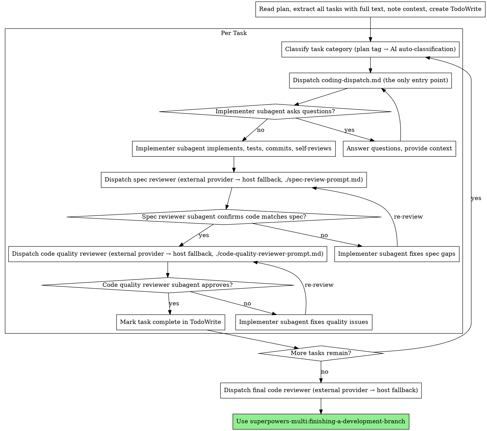

# SDD Enforce coding-dispatch Routing Implementation Plan

> **For agentic workers:** REQUIRED SUB-SKILL: Use superpowers-multi:subagent-driven-development (recommended) or superpowers-multi:executing-plans to implement this plan task-by-task. Steps use checkbox (`- [ ]`) syntax for tracking.

**Goal:** Make `skills/subagent-driven-development/coding-dispatch.md` the only entry point for SDD task implementation so the user's `coding.rules` configuration is honored.

**Architecture:** Rename `implementer-prompt.md` → `coding-fallback-prompt.md` (with a "Moved" shim left at the old path). Strengthen `skills/subagent-driven-development/SKILL.md` so the host AI cannot bypass `coding-dispatch.md` (flow-diagram redraw + restructured "Templates and dispatchers" section + new mandatory-routing section). Update `coding-dispatch.md` Step 7 references to the new filename. Bump to v5.0.11. Document the change in RELEASE-NOTES. Run static checks and a manual evaluation against five real SDD scenarios.

**Tech Stack:** Markdown skill files (no code), Bash + grep + `test -f` for static verification, real SDD sessions in fresh contexts for the manual evaluation.

**Spec reference:** [`docs/superpowers/specs/2026-05-08-sdd-enforce-coding-dispatch-design.md`](../specs/2026-05-08-sdd-enforce-coding-dispatch-design.md)

---

## File Structure

| File | Purpose | Change |
|---|---|---|
| `skills/subagent-driven-development/coding-fallback-prompt.md` | The renamed template, marked "Internal use only" — invoked by `coding-dispatch.md` Step 7 | **Create** (via `git mv` + edit) |
| `skills/subagent-driven-development/implementer-prompt.md` | "Moved" shim; redirect notice only, no prompt body | **Replace contents** |
| `skills/subagent-driven-development/coding-dispatch.md` | Step 7 references the new filename | Modify (2 lines) |
| `skills/subagent-driven-development/SKILL.md` | Flow diagram + "Templates and dispatchers" section + new "Always Through" section | Modify (3 sub-edits) |
| `RELEASE-NOTES.md` | v5.0.11 entry at the top | Prepend new entry |
| `.claude-plugin/plugin.json`, `.claude-plugin/marketplace.json`, `.cursor-plugin/plugin.json`, `gemini-extension.json`, `package.json` | Version bump 5.0.10 → 5.0.11 | Modify |

---

## Task 1: Rename `implementer-prompt.md` → `coding-fallback-prompt.md` and add "Internal use only" header

**Files:**
- Move: `skills/subagent-driven-development/implementer-prompt.md` → `skills/subagent-driven-development/coding-fallback-prompt.md`
- Modify: `skills/subagent-driven-development/coding-fallback-prompt.md` (prepend header)

- [ ] **Step 1: Verify the source file exists and the destination does not**

Run:
```bash
test -f skills/subagent-driven-development/implementer-prompt.md && echo "source: ok" || echo "source: MISSING"
test ! -e skills/subagent-driven-development/coding-fallback-prompt.md && echo "destination: clean" || echo "destination: CONFLICT"
```
Expected:
```
source: ok
destination: clean
```

- [ ] **Step 2: Rename via `git mv` to preserve history**

Run:
```bash
git mv skills/subagent-driven-development/implementer-prompt.md skills/subagent-driven-development/coding-fallback-prompt.md
```
Expected: no output, exit 0.

- [ ] **Step 3: Verify the rename**

Run:
```bash
git status --short
```
Expected (relevant entry):
```
R  skills/subagent-driven-development/implementer-prompt.md -> skills/subagent-driven-development/coding-fallback-prompt.md
```

- [ ] **Step 4: Prepend the "Internal use only" header**

Edit `skills/subagent-driven-development/coding-fallback-prompt.md` so its content begins with the following block, immediately followed by the **existing first line** of the file (`# Implementer Subagent Prompt Template`) and everything below it (do not delete or modify the original content):

```markdown
# Coding Fallback Prompt Template

**Internal use only.** This template is invoked by `./coding-dispatch.md`
Step 7 (Fallback) when the configured external coding provider is
unavailable, disabled, or fails. It is not a top-level entry point —
the SDD skill must always go through `./coding-dispatch.md` for each
task to honor the user's `coding.rules` configuration.

---

```

After this edit, the file should look like:

```markdown
# Coding Fallback Prompt Template

**Internal use only.** This template is invoked by ...

---

# Implementer Subagent Prompt Template

Use this template when dispatching an implementer subagent.

```
Task tool (general-purpose):
  description: "Implement Task N: [task name]"
  ...
```
```

(The original `# Implementer Subagent Prompt Template` H1 and everything below it remain unchanged.)

- [ ] **Step 5: Verify the header is in place**

Run:
```bash
head -3 skills/subagent-driven-development/coding-fallback-prompt.md
```
Expected:
```
# Coding Fallback Prompt Template

**Internal use only.** This template is invoked by `./coding-dispatch.md`
```

Run:
```bash
grep -c "Task tool (general-purpose):" skills/subagent-driven-development/coding-fallback-prompt.md
```
Expected: `1` (original prompt body still present).

- [ ] **Step 6: Commit**

```bash
git add skills/subagent-driven-development/coding-fallback-prompt.md
git commit -m "refactor: rename implementer-prompt.md to coding-fallback-prompt.md

Renames the SDD implementer template to clarify its role as the
fallback template invoked by coding-dispatch.md Step 7 — not as a
top-level entry point. Adds an 'Internal use only' header. Original
prompt body is preserved verbatim below the new header.

The shim at the old path is added in the next commit."
```

---

## Task 2: Replace old `implementer-prompt.md` with a "Moved" shim

**Files:**
- Create: `skills/subagent-driven-development/implementer-prompt.md` (new file at the old path)

- [ ] **Step 1: Confirm the old path is currently absent**

Run:
```bash
test ! -e skills/subagent-driven-development/implementer-prompt.md && echo "absent (expected)" || echo "still present (unexpected)"
```
Expected: `absent (expected)`. (Task 1 moved the file away.)

- [ ] **Step 2: Create the shim with redirect-only content**

Create the file `skills/subagent-driven-development/implementer-prompt.md` with **exactly** this content:

```markdown
# Moved

This file was renamed to `coding-fallback-prompt.md` to clarify its role
as the fallback template inside `./coding-dispatch.md` Step 7. It is no
longer a top-level entry point.

**For SDD task implementation, always invoke `./coding-dispatch.md`** —
do not dispatch this template directly. The dispatcher will route the
task to the configured AI provider, falling back to the host implementer
template only when necessary.

See:
- `./coding-dispatch.md` — coding task routing logic
- `./coding-fallback-prompt.md` — the renamed template (internal)
```

- [ ] **Step 3: Verify the shim has no prompt body**

Run:
```bash
head -1 skills/subagent-driven-development/implementer-prompt.md
```
Expected: `# Moved`

Run:
```bash
grep -c "Task tool (general-purpose):" skills/subagent-driven-development/implementer-prompt.md
```
Expected: `0` (shim must NOT contain the old prompt body).

Run:
```bash
wc -l skills/subagent-driven-development/implementer-prompt.md
```
Expected: a small number (≤ 20). The original file was 113 lines; the shim should be much shorter.

- [ ] **Step 4: Commit**

```bash
git add skills/subagent-driven-development/implementer-prompt.md
git commit -m "refactor: replace implementer-prompt.md with 'Moved' shim

The old path is preserved as a redirect-only stub so historical plan
and spec documents that reference it continue to resolve, but anyone
reading the file is told to invoke ./coding-dispatch.md instead. The
shim deliberately omits the prompt body so direct misuse becomes
visible (a host AI copying this file would get nothing usable)."
```

---

## Task 3: Update `coding-dispatch.md` Step 7 references to the new filename

**Files:**
- Modify: `skills/subagent-driven-development/coding-dispatch.md` (Step 7 section, 2 lines around L180 / L184)

- [ ] **Step 1: Confirm the two references exist**

Run:
```bash
grep -n "implementer-prompt.md" skills/subagent-driven-development/coding-dispatch.md
```
Expected: 2 matches (Step 7 fallback path).

- [ ] **Step 2: Replace both references with the new filename**

Edit `skills/subagent-driven-development/coding-dispatch.md`. Find both occurrences of `./implementer-prompt.md` and replace each with `./coding-fallback-prompt.md`. Both occurrences are inside Step 7 (Fallback). The exact strings to change:

```
- Use host AI `general-purpose` subagent with `./implementer-prompt.md` template.
```
becomes
```
- Use host AI `general-purpose` subagent with `./coding-fallback-prompt.md` template.
```

and:

```
2. Use host AI `general-purpose` subagent with `./implementer-prompt.md` template, passing all accumulated Q&A context (if any) in the Context section.
```
becomes:
```
2. Use host AI `general-purpose` subagent with `./coding-fallback-prompt.md` template, passing all accumulated Q&A context (if any) in the Context section.
```

- [ ] **Step 3: Verify both references updated**

Run:
```bash
grep -c "implementer-prompt.md" skills/subagent-driven-development/coding-dispatch.md
```
Expected: `0`.

Run:
```bash
grep -c "coding-fallback-prompt.md" skills/subagent-driven-development/coding-dispatch.md
```
Expected: `2`.

- [ ] **Step 4: Commit**

```bash
git add skills/subagent-driven-development/coding-dispatch.md
git commit -m "fix: point coding-dispatch.md Step 7 at coding-fallback-prompt.md

Step 7 (Fallback) referenced the old implementer-prompt.md path twice.
Update both references to the renamed coding-fallback-prompt.md."
```

---

## Task 4: Redraw `SKILL.md` flow diagram so coding-dispatch is the only entry point

**Files:**
- Modify: `skills/subagent-driven-development/SKILL.md` (the `digraph process { ... }` block, currently L44-94)

The current diagram has two structural problems: a standalone "Dispatch implementer subagent (./implementer-prompt.md)" node that the host AI can read as an alternative entry, and a binary diamond ("provider succeeded" vs "fallback to host AI") that exposes coding-dispatch's internal decision. The new diagram hides that decision inside coding-dispatch and makes implementation flow as a single arrow.

- [ ] **Step 1: Confirm the existing diagram is in place**

Run:
```bash
grep -c 'Dispatch implementer subagent (./implementer-prompt.md)' skills/subagent-driven-development/SKILL.md
```
Expected: `4` (4 occurrences across nodes/arrows in the diagram).

- [ ] **Step 2: Replace the diagram**

Replace the entire ` ```dot ... ``` ` block (currently L44-94) with the following exact content:

````markdown

````

Key differences from the old diagram:
- Removed node: "Dispatch coding provider (./coding-dispatch.md)" → renamed to "Dispatch coding-dispatch.md (the only entry point)" (single label, emphasizing exclusivity).
- Removed node: "Coding dispatch returns result or falls back to implementer" diamond.
- Removed node: "Dispatch implementer subagent (./implementer-prompt.md)" (no longer a separate step).
- Single edge from "Dispatch coding-dispatch.md (the only entry point)" → "Implementer subagent asks questions?" (provider/fallback decision is internal to coding-dispatch).
- "Answer questions" loop now points back to "Dispatch coding-dispatch.md (the only entry point)" so re-dispatch also goes through routing.

- [ ] **Step 3: Verify the diagram is updated**

Run:
```bash
grep -c "implementer-prompt.md" skills/subagent-driven-development/SKILL.md
```
Expected: this will still be non-zero because the "Templates and dispatchers" section is updated in Task 5. After Task 4 alone, expect: `1` (just the Prompt Templates list line that we'll fix in Task 5).

Run:
```bash
grep -c 'Dispatch coding-dispatch.md (the only entry point)' skills/subagent-driven-development/SKILL.md
```
Expected: `4` (1 node declaration + 3 edges: incoming from Classify, outgoing to Implementer asks?, and incoming from Answer questions loop).

Run:
```bash
grep -c 'Coding dispatch returns result or falls back to implementer' skills/subagent-driven-development/SKILL.md
```
Expected: `0` (diamond fully removed).

- [ ] **Step 4: Commit**

```bash
git add skills/subagent-driven-development/SKILL.md
git commit -m "refactor(skill): redraw SDD flow with coding-dispatch as sole entry

Removes the standalone implementer-subagent node and the binary
'fallback to host AI' diamond. Provider vs internal-fallback selection
is now hidden inside coding-dispatch.md, where it belongs. The host
AI no longer sees a diagram path that bypasses coding-dispatch.

Templates list and the new mandatory-routing section come in
follow-up commits."
```

---

## Task 5: Restructure `SKILL.md` "Prompt Templates" → "Templates and dispatchers"

**Files:**
- Modify: `skills/subagent-driven-development/SKILL.md` (Prompt Templates section, around L145-152)

- [ ] **Step 1: Confirm the existing section is in place**

Run:
```bash
grep -n "## Prompt Templates" skills/subagent-driven-development/SKILL.md
```
Expected: 1 line match.

- [ ] **Step 2: Replace the section**

Find the block:

```markdown
## Prompt Templates

- `./coding-dispatch.md` - Coding task routing logic (category → provider → CLI/subagent → validation → fallback)
- `./coding-prompt.md` - Provider-agnostic coding prompt template (used by coding-dispatch.md)
- `./implementer-prompt.md` - Dispatch implementer subagent (used as fallback when coding dispatch is disabled or fails)
- `./spec-review-prompt.md` - Spec compliance review template (provider-agnostic)
- `./code-quality-reviewer-prompt.md` - Code quality review dispatch reference (delegates to `review-dispatch.md`)
- `skills/requesting-code-review/review-dispatch.md` - Centralized dispatch logic for all review types
```

and replace it with:

```markdown
## Templates and dispatchers

**Entry points (host AI invokes these directly):**

- `./coding-dispatch.md` — Coding task routing logic. **Always use this for task implementation.** Honors `coding.rules` configuration; falls back to the host implementer when external providers are unavailable.
- `./spec-review-prompt.md` — Spec compliance review template (provider-agnostic)
- `./code-quality-reviewer-prompt.md` — Code quality review dispatch reference (delegates to `review-dispatch.md`)
- `skills/requesting-code-review/review-dispatch.md` — Centralized dispatch logic for all review types

**Internal templates (invoked by `coding-dispatch.md`, not directly):**

- `./coding-prompt.md` — Provider-agnostic coding prompt (used by external CLI providers)
- `./coding-fallback-prompt.md` — Host AI subagent prompt (used by Step 7 fallback)
```

- [ ] **Step 3: Verify the section is updated**

Run:
```bash
grep -c "## Templates and dispatchers" skills/subagent-driven-development/SKILL.md
```
Expected: `1`.

Run:
```bash
grep -c "## Prompt Templates" skills/subagent-driven-development/SKILL.md
```
Expected: `0` (old heading removed).

Run:
```bash
grep -c "implementer-prompt.md" skills/subagent-driven-development/SKILL.md
```
Expected: `0` (the Prompt Templates list was the last reference; flow diagram was already updated in Task 4).

Run:
```bash
grep -c "coding-fallback-prompt.md" skills/subagent-driven-development/SKILL.md
```
Expected: `1` (in the new "Internal templates" sub-block).

Run:
```bash
grep -c "Entry points (host AI invokes these directly):" skills/subagent-driven-development/SKILL.md
```
Expected: `1`.

Run:
```bash
grep -c "Internal templates (invoked by " skills/subagent-driven-development/SKILL.md
```
Expected: `1`.

- [ ] **Step 4: Commit**

```bash
git add skills/subagent-driven-development/SKILL.md
git commit -m "refactor(skill): split SDD templates into entry points vs internal

Renames 'Prompt Templates' to 'Templates and dispatchers' and splits
the list into two sub-blocks. Only coding-dispatch.md and the review
templates are entry points; coding-prompt.md and the renamed
coding-fallback-prompt.md are explicitly marked as internal templates
that the host AI must not dispatch directly."
```

---

## Task 6: Add `SKILL.md` "Task Implementation: Always Through coding-dispatch.md" section

**Files:**
- Modify: `skills/subagent-driven-development/SKILL.md` (insert a new section immediately after the closing ` ``` ` of the flow diagram, before `## Model Selection`)

- [ ] **Step 1: Confirm the insertion point**

Run:
```bash
grep -n "^## Model Selection" skills/subagent-driven-development/SKILL.md
```
Expected: 1 line match. The new section is inserted **just before** this line, separated by a blank line.

- [ ] **Step 2: Insert the new section**

Insert the following block immediately before the `## Model Selection` heading:

```markdown
## Task Implementation: Always Through coding-dispatch.md

For each task, **always** invoke `./coding-dispatch.md` with the
classified `task_category`. This is the only correct entry point for
task implementation in SDD.

**Do not** dispatch `./coding-fallback-prompt.md` (or its predecessor
`./implementer-prompt.md`) directly — bypassing `coding-dispatch.md`
ignores the user's `coding.rules` configuration and prevents the
configured external AI provider from being used.

The dispatcher itself decides whether to route to an external provider
or fall back to the host implementer; that decision belongs to
`coding-dispatch.md`, not to the SDD controller.

```

(The trailing blank line is intentional — it separates the new section from `## Model Selection`.)

- [ ] **Step 3: Verify the section is in place**

Run:
```bash
grep -c "## Task Implementation: Always Through coding-dispatch.md" skills/subagent-driven-development/SKILL.md
```
Expected: `1`.

Run:
```bash
grep -B0 -A2 "^## Task Implementation: Always Through coding-dispatch.md" skills/subagent-driven-development/SKILL.md | head -3
```
Expected output starts with:
```
## Task Implementation: Always Through coding-dispatch.md

For each task, **always** invoke `./coding-dispatch.md` with the
```

Verify ordering — the new section must come BEFORE `## Model Selection`:

```bash
awk '/^## (Task Implementation: Always|Model Selection)/ { print NR, $0 }' skills/subagent-driven-development/SKILL.md
```
Expected: two lines, with `Task Implementation:` at a smaller line number than `Model Selection`.

- [ ] **Step 4: Commit**

```bash
git add skills/subagent-driven-development/SKILL.md
git commit -m "feat(skill): add 'Always Through coding-dispatch.md' enforcement section

Adds an explicit imperative section right after the flow diagram so
the host AI cannot mistake coding-dispatch.md for an optional step.
Names the failure mode (bypassing coding-dispatch ignores coding.rules)
and clarifies that the provider-vs-fallback choice belongs to the
dispatcher, not the SDD controller."
```

---

## Task 7: Add v5.0.11 RELEASE-NOTES entry

**Files:**
- Modify: `RELEASE-NOTES.md` (prepend new top-of-file entry)

- [ ] **Step 1: Confirm current top entry is v5.0.10**

Run:
```bash
head -5 RELEASE-NOTES.md
```
Expected: starts with `# Superpowers Release Notes`, then `## v5.0.10 (...)`.

- [ ] **Step 2: Prepend the v5.0.11 entry**

Edit `RELEASE-NOTES.md`. Immediately after the line `# Superpowers Release Notes` and the following blank line, insert this block before the existing `## v5.0.10 (...)` entry:

```markdown
## v5.0.11 (2026-05-08)

### Subagent-Driven Development: enforce coding-dispatch routing (fork-specific)

Fixes a bug where SDD's host AI could bypass the multi-AI coding dispatch introduced in #6 / #8 by directly invoking the implementer prompt template, ignoring the user's `coding.rules` configuration.

- **Renamed** `skills/subagent-driven-development/implementer-prompt.md` → `coding-fallback-prompt.md` to clarify that this template is invoked only by `coding-dispatch.md` Step 7 (fallback) — not as a top-level entry point. The original file is replaced with a short "Moved" shim, so historical plan/spec references continue to resolve.
- **SKILL.md** flow diagram and prose strengthened: `coding-dispatch.md` is now the sole entry point for task implementation. The diagram no longer shows the implementer as a sibling node, the "Prompt Templates" section was split into "Entry points" vs "Internal templates", and a new `## Task Implementation: Always Through coding-dispatch.md` section makes the routing requirement explicit.
- **`coding-dispatch.md`** Step 7 references updated to the new filename.
- **Backward compatible** for users: `coding.rules` configurations now actually take effect. No config schema changes; no migration required. Long-lived sessions that already loaded the v5.0.10 SKILL.md may need to be restarted for the change to take effect.

```

- [ ] **Step 3: Verify the entry is in place**

Run:
```bash
head -5 RELEASE-NOTES.md | grep -c "^## v5.0.11 (2026-05-08)"
```
Expected: `1` (the v5.0.11 heading is within the first 5 lines, i.e. it is the new top entry).

Run:
```bash
awk '/^## v5\.0\.(11|10)/ { print NR, $0 }' RELEASE-NOTES.md | head -2
```
Expected: v5.0.11 line number < v5.0.10 line number (v5.0.11 sits above v5.0.10).

- [ ] **Step 4: Commit**

```bash
git add RELEASE-NOTES.md
git commit -m "docs: add v5.0.11 release notes for SDD coding-dispatch enforcement"
```

---

## Task 8: Version bump 5.0.10 → 5.0.11 across 5 manifest files

**Files:**
- Modify: `.claude-plugin/plugin.json`
- Modify: `.claude-plugin/marketplace.json`
- Modify: `.cursor-plugin/plugin.json`
- Modify: `gemini-extension.json`
- Modify: `package.json`

- [ ] **Step 1: Check current declared version in all 5 manifests**

Run:
```bash
scripts/bump-version.sh --check 2>&1 | head -20
```
Expected: shows all 5 files at `5.0.10` and reports them in sync.

If `scripts/bump-version.sh` is not present, run instead:

```bash
for f in .claude-plugin/plugin.json .claude-plugin/marketplace.json .cursor-plugin/plugin.json gemini-extension.json package.json; do
  echo -n "$f: "
  grep -m1 '"version"' "$f"
done
```
Expected: each line shows `"version": "5.0.10"`.

- [ ] **Step 2: Run the version bump**

Run:
```bash
scripts/bump-version.sh 5.0.11
```
Expected: script reports updated files. (If the script is not present, manually edit each of the 5 files to change `"version": "5.0.10"` → `"version": "5.0.11"`.)

- [ ] **Step 3: Verify all 5 manifests are at 5.0.11**

Run:
```bash
scripts/bump-version.sh --check 2>&1 | head -20
```
Expected: all 5 files at `5.0.11`, in sync.

If running manually:
```bash
for f in .claude-plugin/plugin.json .claude-plugin/marketplace.json .cursor-plugin/plugin.json gemini-extension.json package.json; do
  echo -n "$f: "
  grep -m1 '"version"' "$f"
done
```
Each line: `"version": "5.0.11"`.

- [ ] **Step 4: Commit**

```bash
git add .claude-plugin/plugin.json .claude-plugin/marketplace.json .cursor-plugin/plugin.json gemini-extension.json package.json
git commit -m "chore: bump version to 5.0.11"
```

---

## Task 9: Static verification (whole-branch reference check)

**Files:** none — verification only.

- [ ] **Step 1: Verify no live references to the old filename remain in `skills/`**

Run:
```bash
grep -rn "implementer-prompt.md" skills/ 2>/dev/null
```
Expected: zero matches under `skills/` (the old name appears only inside the shim FILE NAME itself, but `grep -rn "implementer-prompt.md" skills/` greps content, not filenames; the shim's content references `coding-fallback-prompt.md`, not its own name).

- [ ] **Step 2: Verify the shim file still exists at the old path**

Run:
```bash
test -f skills/subagent-driven-development/implementer-prompt.md && echo "shim exists" || echo "MISSING shim"
```
Expected: `shim exists`.

- [ ] **Step 3: Verify the new file exists at the new path**

Run:
```bash
test -f skills/subagent-driven-development/coding-fallback-prompt.md && echo "new file exists" || echo "MISSING new file"
```
Expected: `new file exists`.

- [ ] **Step 4: Verify SKILL.md structural changes**

Run:
```bash
grep -c "## Task Implementation: Always Through coding-dispatch.md" skills/subagent-driven-development/SKILL.md
```
Expected: `1`.

Run:
```bash
grep -c "## Templates and dispatchers" skills/subagent-driven-development/SKILL.md
```
Expected: `1`.

Run:
```bash
grep -c "Dispatch coding-dispatch.md (the only entry point)" skills/subagent-driven-development/SKILL.md
```
Expected: `4` (one node declaration + three edges in the diagram).

- [ ] **Step 5: Verify coding-dispatch.md updates**

Run:
```bash
grep -c "coding-fallback-prompt.md" skills/subagent-driven-development/coding-dispatch.md
```
Expected: `2`.

Run:
```bash
grep -c "implementer-prompt.md" skills/subagent-driven-development/coding-dispatch.md
```
Expected: `0`.

- [ ] **Step 6: Verify shim has no prompt body**

Run:
```bash
grep -c "Task tool (general-purpose):" skills/subagent-driven-development/implementer-prompt.md
```
Expected: `0`.

Run:
```bash
head -1 skills/subagent-driven-development/implementer-prompt.md
```
Expected: `# Moved`.

- [ ] **Step 7: Verify version sync**

Run:
```bash
scripts/bump-version.sh --check 2>&1 | head -20
```
Expected: all 5 files at `5.0.11`, in sync.

- [ ] **Step 8: Verify historical references in `docs/` are still resolvable (informational)**

Run:
```bash
grep -rn "implementer-prompt.md" docs/ 2>/dev/null | wc -l
```
Expected: a non-zero number (historical plans/specs from PR #1 / #4 / #6 reference the old name). Each such reference resolves via the shim — no action needed.

- [ ] **Step 9: Commit verification record (no file changes; just an explicit step marker)**

This step has no commit. Note the verification results in the PR description when opening the PR. If any check above fails, fix it before proceeding to Task 10.

---

## Task 10: Manual evaluation — five real SDD scenarios

This task implements the eval requirement from CLAUDE.md "Skill Changes Require Evaluation". Skills are behavior-shaping content, and rewording may not actually change host-AI behavior. We must observe real sessions to confirm the fix takes effect.

**This task does not commit code.** It produces eval evidence captured in the PR description.

**Prerequisites:**
- Plugin update is reflected in the harness: `~/.claude/plugins/cache/superpowers-multi/superpowers-multi/5.0.11/` exists and is the active install. Until merge + marketplace update, this requires a local install (e.g., `/plugin install` from the local `feature/use-ai-dispatch-from-subagent-driven` branch).
- A small test plan with 1-2 trivially implementable tasks (e.g., add a constant + import line). The same plan is reused across S1-S5 with different config.

**Minimum gating (must pass before merge):** S1 and S2.
**Recommended (full confidence):** S1-S5.

- [ ] **Scenario S1: Provider configured (default)**

Setup:
- Config: `${XDG_CONFIG_HOME:-~/.config}/superpowers/review-config.json` set to:
  ```json
  { "review_provider": "codex", "coding": { "enabled": true, "default_provider": "codex", "rules": [] } }
  ```

Run a fresh SDD session in a new terminal/window using the test plan.

Expected:
- Host AI invokes `./coding-dispatch.md` (visible in announcements).
- coding-dispatch resolves provider to `codex`, runs the codex CLI, captures the result.
- The implementer task is **NOT** dispatched via host `general-purpose` subagent.

Record outcome: PASS / FAIL + 1-line observation.

- [ ] **Scenario S2: Coding explicitly disabled**

Setup:
- Config: same file, but `coding.enabled: false`:
  ```json
  { "review_provider": "codex", "coding": { "enabled": false } }
  ```

Run a fresh SDD session.

Expected:
- Host AI invokes `./coding-dispatch.md`.
- coding-dispatch Step 1 Case 3 fires (disabled) → silent fallback to Step 7.
- Step 7 dispatches host `general-purpose` subagent **with `./coding-fallback-prompt.md`** template (NOT `./implementer-prompt.md`).
- Visible in dispatch metadata: the prompt path referenced is `coding-fallback-prompt.md`.

Record outcome: PASS / FAIL + 1-line observation.

- [ ] **Scenario S3: No config (Setup UX)**

Setup:
- Both `${XDG_CONFIG_HOME:-~/.config}/superpowers/review-config.json` AND `<repo>/.superpowers/review-config.json` absent.

Run a fresh SDD session.

Expected:
- First task triggers `coding-dispatch.md` Step 1 → config-loading.md Step 6 (Setup UX).
- User sees the prompt: "Multi-AI coding dispatch is not configured. Pick a provider to set up."

Decline the setup. Expected: silent fallback path → Step 7 with `coding-fallback-prompt.md`.

Record outcome: PASS / FAIL + 1-line observation.

- [ ] **Scenario S4: Category tag in plan**

Setup:
- Config: rules-based:
  ```json
  { "coding": { "enabled": true, "default_provider": "codex", "rules": [{ "category": "frontend", "provider": "claude-code" }, { "category": "backend", "provider": "codex" }] } }
  ```
- Test plan task includes `category: frontend`.

Run a fresh SDD session.

Expected:
- coding-dispatch resolves provider to `claude-code` for that task (frontend rule wins).

Record outcome: PASS / FAIL + 1-line observation.

- [ ] **Scenario S5: No tag, auto-classification**

Setup:
- Same config as S4.
- Test plan task with NO `category:` field, content describing API endpoint work (clearly backend).

Run a fresh SDD session.

Expected:
- AI classifies the task as `backend` → coding-dispatch resolves provider to `codex`.

Record outcome: PASS / FAIL + 1-line observation.

- [ ] **Step Final: Compile eval report for the PR**

Format eval results as a short table for the PR description:

```
| Scenario | Status | Observation |
|---|---|---|
| S1 Provider configured | PASS / FAIL | ... |
| S2 Coding disabled | PASS / FAIL | ... |
| S3 No config / Setup UX | PASS / FAIL | ... |
| S4 Category tag | PASS / FAIL | ... |
| S5 Auto-classification | PASS / FAIL | ... |
```

If S1 or S2 fails, **STOP** and revisit the SKILL.md prose. The fix did not take effect; further strengthening of the SKILL.md text is required. Do not merge.

If S1+S2 pass and S3-S5 are not run, that is acceptable per the minimum-gating policy in the spec.

---

## Manual Verification Checklist (post-merge)

After PR merge, the maintainer can run the following on the local install to confirm the change is active in the deployed plugin (not just on the feature branch):

1. `/plugin marketplace update superpowers-multi` → marketplace clone advances past commit that merges this PR.
2. `/plugin install superpowers-multi@superpowers-multi` (or rely on the auto-bump from marketplace update).
3. `ls ~/.claude/plugins/cache/superpowers-multi/superpowers-multi/` → `5.0.11/` directory exists.
4. `head -3 ~/.claude/plugins/cache/superpowers-multi/superpowers-multi/5.0.11/skills/subagent-driven-development/coding-fallback-prompt.md` → starts with `# Coding Fallback Prompt Template`.
5. `head -1 ~/.claude/plugins/cache/superpowers-multi/superpowers-multi/5.0.11/skills/subagent-driven-development/implementer-prompt.md` → `# Moved`.
6. Open a new session (not the development one) and start an SDD task with `coding.default_provider: "codex"` configured. Observe whether codex is actually invoked. (This is S1 in production.)

If any of 1-6 fails, the rollout is incomplete. Re-run `/plugin marketplace update` first; only the marketplace clone change can swap the active version.
